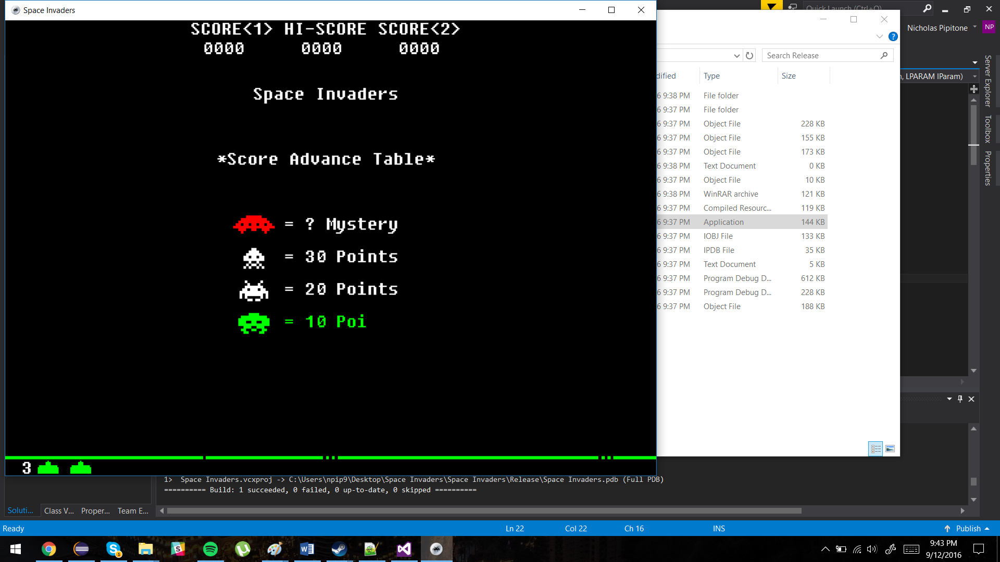
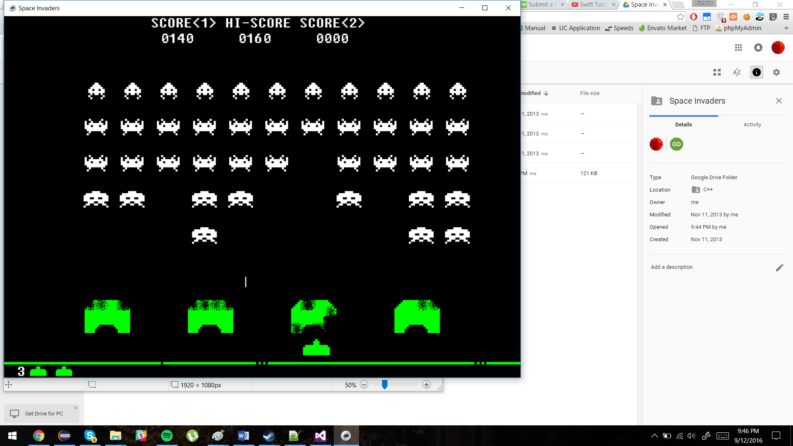

# space-invaders
First graphics project. Made 7th/8th grade summer using DirectX. Taught by Chili Tomato Noodle tutorials.

This requires an older version of DirectX and Visual Studio DLLs to run, but the code is available for recompilation on your platform. Since this takes a while, I put screenshots below for easy viewing.

